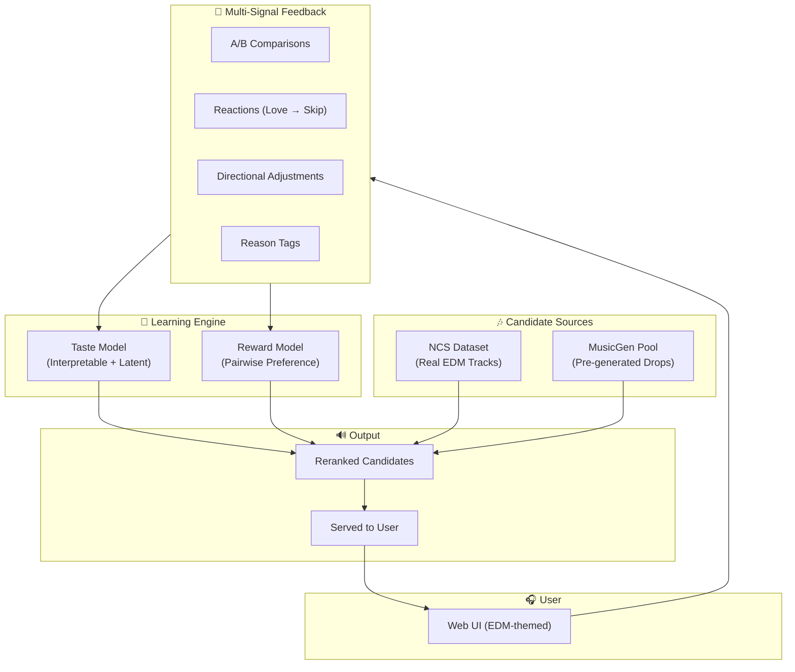
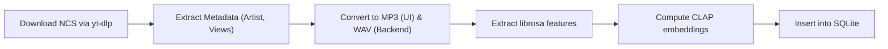
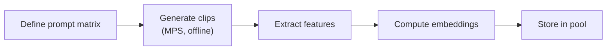
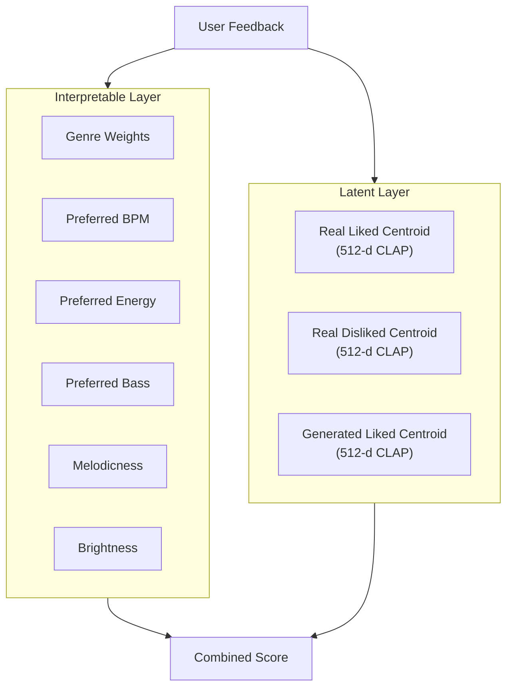
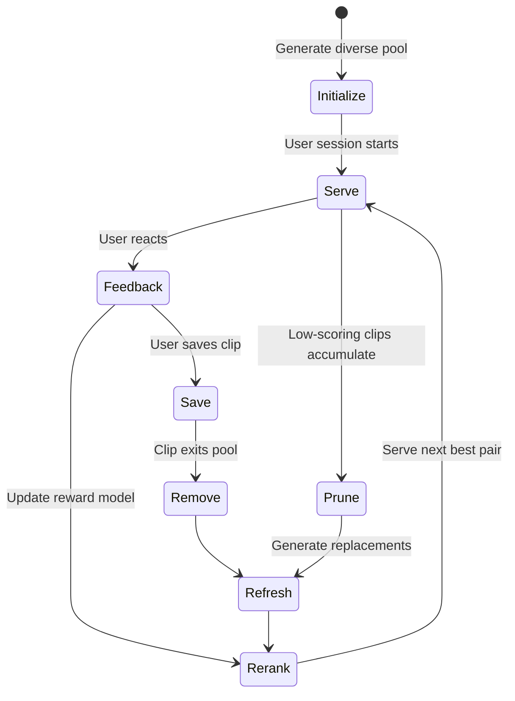
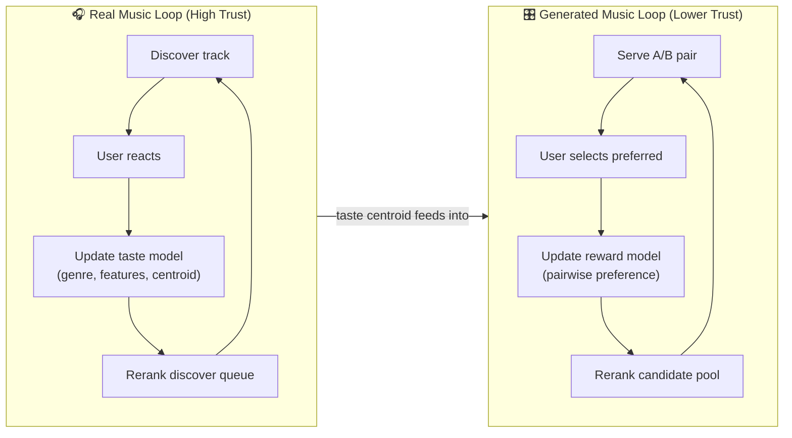
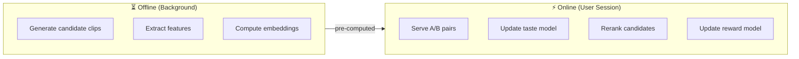

# 🎵 Riddim — System Design Document

> **Version:** 0.1.0 — Initial Draft  
> **Date:** 2026-03-24  
> **Status:** Living Document  

---

## 1. Overview

**Riddim** is a human-in-the-loop AI system that learns a user's EDM music taste through multi-signal interaction and improves alignment across two output channels:

| Channel | Source | Purpose |
|---------|--------|---------|
| **Discover** | NCS dataset (real tracks) | Ground truth taste learning |
| **Generate** | MusicGen (AI-generated drops) | Preference-aligned generation |

> **Core insight:** Riddim does not try to generate perfect music — it learns to *select* the right music by modeling user preference.

---

## 2. Design Philosophy

| Principle | Rationale |
|-----------|-----------|
| **Learning the user > Improving the generator** | MusicGen quality is fixed; alignment is learnable |
| **Selection > Generation** | Pre-generate, then rank — avoids latency |
| **Feedback-driven adaptation** | Every interaction produces a learning signal |
| **Latency-aware design** | Apple Silicon constraints require offline generation and caching |
| **Interpretable + latent** | Hybrid taste model balances explainability with expressiveness |

### Problem Reframing

Traditional framing: *"How do we generate better music?"*  
Riddim's framing: *"How do we select the music that best matches this user?"*

This transforms a generation quality problem into a **preference alignment** problem.

---

## 3. High-Level Architecture



---

## 4. Technology Stack

| Layer | Technology | Notes |
|-------|-----------|-------|
| **Frontend** | Vite + React | Dark/neon EDM aesthetic; custom audio player components |
| **Backend** | FastAPI (Python) | REST API serving taste model, reward model, and audio |
| **Audio Features** | librosa | BPM, energy, spectral, onset extraction |
| **Audio Embeddings** | CLAP | Contrastive Language-Audio Pretraining |
| **Music Generation** | MusicGen (medium, ~1.5B) | Offline pre-generation on Apple Silicon (MPS) |
| **Reward Model** | XGBoost (scikit-learn fallback) | Pairwise preference classifier |
| **Visualization** | UMAP + D3.js | Taste map rendered in the browser |
| **Database** | SQLite | Local-first; single-file portability |
| **Audio Storage** | Local filesystem | WAV files + `.npy` embeddings |

### Apple Silicon Considerations

- MusicGen runs on **MPS** (Metal Performance Shaders) — `torch.device("mps")`
- CLAP inference is feasible on M-series chips for batch embedding
- All generation is **offline / background** — never blocks the user session
- Candidate pool is pre-computed and cached to disk

---

## 5. Project Structure

```
riddim/
├── docs/
│   └── system_design.md          # This document
├── frontend/                      # Vite + React app
│   ├── src/
│   │   ├── components/            # Audio player, A/B panel, taste map, etc.
│   │   ├── pages/                 # Onboarding, Discover, Generate, Profile, Saved
│   │   ├── hooks/                 # useAudio, useFeedback, useTasteMap
│   │   ├── styles/                # EDM-themed CSS (neon, dark mode, glassmorphism)
│   │   └── App.jsx
│   └── package.json
├── backend/
│   ├── api/
│   │   ├── routes/                # feedback, tracks, generate, profile, taste_map
│   │   └── main.py                # FastAPI app
│   ├── models/
│   │   ├── taste_model.py         # Hybrid interpretable + latent taste model
│   │   ├── reward_model.py        # Pairwise preference model
│   │   └── feature_extractor.py   # librosa feature extraction
│   ├── pipeline/
│   │   ├── fma_prep.py            # FMA download, filter, feature extraction
│   │   ├── musicgen_pool.py       # Candidate pool generation
│   │   ├── embedding.py           # CLAP embedding pipeline
│   │   └── candidate_manager.py   # Pool pruning, refresh, reranking
│   ├── db/
│   │   ├── schema.sql             # SQLite schema
│   │   └── database.py            # DB connection + query helpers
│   └── config.py                  # Centralized configuration
├── data/
│   ├── ncs/                       # NCS dataset (gitignored)
│   ├── generated/                 # MusicGen clips (gitignored)
│   ├── embeddings/                # .npy embedding cache (gitignored)
│   └── db/                        # SQLite database file (gitignored)
├── scripts/
│   ├── setup_data.py              # One-shot data preparation
│   ├── generate_pool.py           # Batch candidate generation
│   └── extract_features.py       # Batch feature + embedding extraction
├── .gitignore
├── requirements.txt
└── README.md
```

---

## 6. System Components

### 6.1 Frontend — Web UI

The UI is a **dark-mode, neon-accented single-page app** built with Vite + React, inspired by EDM visualizer aesthetics (think: Serum, Ableton, DJ software).

#### Pages / Tabs

| Page | Purpose | Key Components |
|------|---------|----------------|
| **Onboarding** | Seed initial taste preferences | Genre picker, energy/BPM sliders, sample tracks |
| **Discover** | Browse real EDM tracks (FMA) | Swipeable card, reaction buttons, reason tags |
| **Generate** | A/B compare AI-generated drops | Dual waveform player, preference selector, direction sliders |
| **Profile** | View & adjust taste model | Taste map (UMAP), feature bar chart, genre radar |
| **Saved** | Curated collection | Saved tracks list, re-listen, export |

#### Audio Player Component

```
┌─────────────────────────────────────┐
│  ▶  ════════════●══════  1:23/3:45  │
│  ░░░░░▓▓▓▓▓▓▓▓▓▓░░░░░░░░░░░░░░░░  │ ← waveform visualization
│                                     │
│  ❤️ 👍 😐 ⏭️ 🚫                      │ ← reaction bar
│  [too slow] [weak bass] [wrong vibe]│ ← optional reason tags
└─────────────────────────────────────┘
```

#### A/B Comparison Panel

```
┌──────────────┐    ┌──────────────┐
│   Clip A     │    │   Clip B     │
│  ▶ ═══●════  │ vs │  ▶ ═══●════  │
│  ░▓▓▓▓▓░░░░  │    │  ░░▓▓▓▓░░░  │
└──────────────┘    └──────────────┘
      [ A is better ]  [ B is better ]
      Match quality: ● Strong  ○ Close  ○ Weak  ○ Not my taste
      ────────────────────────────────
      Adjustments: [+bass] [+melody] [+energy] [darker] [faster]
```

---

### 6.2 Backend — FastAPI

#### API Routes

| Method | Endpoint | Description |
|--------|----------|-------------|
| `POST` | `/api/feedback/reaction` | Submit discover reaction (love/like/neutral/skip/reject) |
| `POST` | `/api/feedback/ab` | Submit A/B preference |
| `POST` | `/api/feedback/direction` | Submit directional adjustment |
| `GET`  | `/api/tracks/next` | Get next discover track (taste-ranked) |
| `GET`  | `/api/generate/pair` | Get next A/B pair (reward-ranked) |
| `GET`  | `/api/profile` | Get current taste profile |
| `GET`  | `/api/taste-map` | Get UMAP projection data for visualization |
| `POST` | `/api/tracks/save` | Save a track to collection |
| `GET`  | `/api/saved` | Get saved tracks |
| `POST` | `/api/onboarding` | Submit onboarding preferences |

---

### 6.3 Data Sources

#### A. NCS (NoCopyrightSounds) — Real Music

- **Dataset:** Curated YouTube playlist fetching
- **Filter:** High-quality Electronic / EDM genres
- **Acquisition:** Download via `yt-dlp` in `mp3` format
- **Format:** MP3 → converted to WAV (16kHz mono) for feature extraction

#### B. MusicGen — AI-Generated Drops

- **Model:** `meta/musicgen` (Large)
- **Runtime:** Replicate API (Cloud GPUs)
- **Clip length:** ~15 seconds
- **Strategy:** On-demand generation triggered directly from the Web UI

---

## 7. Data Preparation Pipeline

### 7.1 NCS Preparation



#### Steps

1. **Download** curated NCS videos using `ytsearch40` (~2 hours runtime)
2. **Parse metadata** directly from the YouTube title/description avoiding API limits
3. **Convert audio** to MP3 (for fast web streaming) and WAV 16kHz mono (for features)
4. **Extract features** with `librosa` (see §8)
5. **Compute embeddings** with CLAP (see §9)
6. **Store** features, embeddings, and metadata in SQLite

#### Genre Filter Keywords

```python
EDM_GENRES = [
    "Electronic", "Techno", "House", "Trance", "Drum and Bass",
    "Dubstep", "Ambient", "IDM", "Glitch", "Downtempo",
    "Breakbeat", "Electro", "Garage", "Hardstyle", "Jungle"
]
```

### 7.2 MusicGen Candidate Pool Generation



#### Prompt Strategy

The initial candidate pool is generated by combining genre, BPM, and energy dimensions:

```python
PROMPT_TEMPLATES = [
    "A {energy} {genre} drop at {bpm} BPM with {character}",
    "An EDM {genre} buildup and drop, {energy} energy, {bpm} BPM",
    "{genre} festival drop, {character}, {energy} intensity",
]

GENRES = ["house", "dubstep", "drum and bass", "trance", "techno", "hardstyle"]

BPM_RANGES = {
    "house":         (124, 128),
    "dubstep":       (138, 142),
    "drum and bass": (170, 178),
    "trance":        (136, 142),
    "techno":        (128, 135),
    "hardstyle":     (150, 160),
}

ENERGY_LEVELS = ["low", "medium", "high", "explosive"]

CHARACTERS = [
    "heavy bass", "melodic synths", "dark atmosphere",
    "euphoric chords", "distorted wobble", "crisp percussion",
    "ethereal pads", "aggressive leads", "minimal groove"
]
```

#### Pool Size

- **Initial pool:** 100 clips per user
- **Distribution:** Uniform across genre × energy × BPM buckets
- **Generation time estimate:** ~2–4 hours on M-series Mac (offline, one-time)

---

## 8. Feature Extraction Pipeline

**Library:** `librosa`

| Feature | Extraction Method | Intuition |
|---------|-------------------|-----------|
| **BPM** | `librosa.beat.beat_track()` | Tempo preference |
| **Energy (RMS)** | `librosa.feature.rms()` → mean | Overall loudness / intensity |
| **Bass Energy** | Bandpass 20–250 Hz → RMS | Low-end preference |
| **Spectral Centroid** | `librosa.feature.spectral_centroid()` → mean | Brightness indicator |
| **Onset Density** | `librosa.onset.onset_detect()` → count / duration | Rhythmic complexity |

#### Feature Vector Schema

```python
@dataclass
class AudioFeatures:
    track_id: str
    bpm: float
    energy_rms: float
    bass_energy: float
    spectral_centroid: float
    onset_density: float
    duration_sec: float
```

All features are **z-score normalized** per-dataset (NCS and generated pools normalized independently).

---

## 9. Embedding Pipeline

**Model:** [CLAP](https://github.com/LAION-AI/CLAP) (Contrastive Language-Audio Pretraining)

### Purpose

| Use Case | Description |
|----------|-------------|
| **Similarity** | Cosine similarity between track embeddings |
| **Taste Centroid** | Weighted average of liked/disliked embeddings |
| **Clustering** | UMAP projection for taste map visualization |
| **Reward Model Input** | Embedding difference as a feature |

### Pipeline

```python
# Pseudocode
model = laion_clap.CLAP_Module(enable_fusion=False)
model.load_ckpt()

embedding = model.get_audio_embedding_from_filelist(
    [audio_path], use_tensor=False
)  # Returns (1, 512) numpy array
```

- **Embedding dim:** 512
- **Storage:** `.npy` files keyed by `track_id`
- **Batch processing:** Extract all embeddings offline; cache to disk

---

## 10. Feedback System

### 10.1 Discover Feedback (Real Music)

| Action | Signal Strength | Numeric Value |
|--------|----------------|---------------|
| ❤️ Love | Strong Positive | +1.0 |
| 👍 Like | Positive | +0.5 |
| 😐 Neutral | Weak | 0.0 |
| ⏭️ Skip | Negative | −0.5 |
| 🚫 Not My Sound | Strong Negative | −1.0 |
| 💾 Save | Highest Confidence | +1.5 |

#### Optional Reason Tags

```python
REASON_TAGS = [
    "too_slow", "too_fast", "too_dark", "too_bright",
    "weak_bass", "too_heavy", "wrong_vibe", "too_repetitive",
    "not_enough_melody", "too_simple", "too_complex"
]
```

Reason tags provide **interpretable direction** for the taste model's feature layer.

### 10.2 Generate Feedback (AI Drops)

#### A/B Comparison

```
Input:  (Clip A, Clip B)
Output: preferred ∈ {A, B}
```

#### Match Quality Rating

| Rating | Numeric | Meaning |
|--------|---------|---------|
| Strong Match | 1.0 | "This is my sound" |
| Close | 0.6 | "Getting there" |
| Weak Match | 0.3 | "Not quite" |
| Not My Taste | 0.0 | "Miss" |

#### Directional Adjustments

| Direction | Feature Target |
|-----------|---------------|
| More bass | ↑ `bass_energy` |
| More melodic | ↑ `melodicness` |
| More energetic | ↑ `energy_rms` |
| Darker | ↓ `spectral_centroid` |
| Brighter | ↑ `spectral_centroid` |
| Faster | ↑ `bpm` |
| Slower | ↓ `bpm` |

---

## 11. Taste Model

### 11.1 Hybrid Architecture



#### Interpretable Layer

```python
class InterpretableTaste:
    genre_weights: dict[str, float]    # e.g. {"house": 0.8, "dubstep": 0.3}
    preferred_bpm: float               # running weighted average
    preferred_energy: float            # running weighted average
    preferred_bass: float              # running weighted average
    melodicness: float                 # −1 (minimal) → +1 (melodic)
    brightness: float                  # −1 (dark) → +1 (bright)
    confidence: float                  # increases with more feedback
```

#### Latent Layer

```python
class LatentTaste:
    real_liked_centroid: np.ndarray     # (512,) — EMA of liked real tracks
    real_disliked_centroid: np.ndarray  # (512,) — EMA of disliked real tracks
    gen_liked_centroid: np.ndarray      # (512,) — EMA of liked generated clips
```

### 11.2 Update Rules

#### Centroid Update (Exponential Moving Average)

```python
def update_centroid(centroid: np.ndarray, new_embedding: np.ndarray, 
                    alpha: float = 0.1) -> np.ndarray:
    """Move centroid toward new embedding."""
    if centroid is None:
        return new_embedding
    return (1 - alpha) * centroid + alpha * new_embedding
```

#### Feature Update

```python
def update_feature_pref(current: float, observed: float, 
                        signal: float, alpha: float = 0.1) -> float:
    """
    Adjust preferred feature value based on feedback.
    signal: feedback strength (−1.0 to +1.5)
    """
    return current + alpha * signal * (observed - current)
```

#### Genre Weight Update

```python
def update_genre_weight(weights: dict, genre: str, signal: float,
                        alpha: float = 0.05) -> dict:
    """Adjust genre weight based on feedback signal."""
    weights[genre] = np.clip(weights.get(genre, 0.5) + alpha * signal, 0.0, 1.0)
    return weights
```

### 11.3 Source Weighting

| Source | Weight | Rationale |
|--------|--------|-----------|
| Saved items | 1.5× | Highest-confidence explicit signal |
| Explicit reactions (real) | 1.0× | Reliable user preference |
| Explicit controls/sliders | 1.0× | Direct user intent |
| A/B comparisons (generated) | 0.8× | Slightly noisier signal |
| Match quality rating | 0.6× | Subjective absolute rating |
| Single interactions | 0.3× | Low confidence |

---

## 12. Reward Model

### 12.1 Formulation

A **pairwise preference classifier** that predicts:

```
P(A preferred over B | features(A), features(B), taste_profile)
```

### 12.2 Input Feature Vector

For each pair `(A, B)`:

```python
reward_features = np.concatenate([
    features_a - features_b,            # feature difference (5-d)
    embedding_a - embedding_b,          # embedding difference (512-d)
    cosine_sim(embedding_a, centroid),   # A's alignment to taste (1-d)
    cosine_sim(embedding_b, centroid),   # B's alignment to taste (1-d)
])
# Total: 519-d input vector
```

### 12.3 Training Data

Each A/B comparison produces one training example:

```python
@dataclass
class PreferencePair:
    features_a: np.ndarray
    features_b: np.ndarray
    embedding_a: np.ndarray
    embedding_b: np.ndarray
    preferred: Literal["A", "B"]        # label
    confidence: float                    # match quality rating
    timestamp: datetime
```

### 12.4 Model Options

| Model | Pros | Cons | Use When |
|-------|------|------|----------|
| **Logistic Regression** | Fast, interpretable | Linear only | < 50 pairs |
| **XGBoost** ⭐ | Non-linear, robust | Needs more data | ≥ 50 pairs |

Transition: Start with Logistic Regression, switch to XGBoost when sufficient data is collected.

### 12.5 Reranking

```python
def rerank_candidates(candidates: list[Clip], taste: TasteModel, 
                      reward: RewardModel) -> list[Clip]:
    """Score and sort candidate clips by predicted preference."""
    anchor = taste.get_centroid()
    scores = []
    for clip in candidates:
        # Combine taste alignment + reward prediction
        taste_score = cosine_similarity(clip.embedding, anchor)
        reward_score = reward.predict_preference_score(clip)
        combined = 0.6 * reward_score + 0.4 * taste_score
        scores.append((clip, combined))
    return sorted(scores, key=lambda x: x[1], reverse=True)
```

---

## 13. Candidate Pool System

### 13.1 Pool Lifecycle



### 13.2 Pool Configuration

```python
POOL_CONFIG = {
    "initial_size": 100,
    "min_size": 40,            # trigger refresh below this
    "refresh_batch_size": 20,  # clips generated per refresh
    "prune_threshold": 0.2,    # score below this → prune
    "max_age_days": 30,        # stale clips get pruned
}
```

### 13.3 Modes

| Mode | Selection Strategy | When |
|------|-------------------|------|
| **Baseline** | Random sampling from pool | Before enough feedback (< 10 pairs) |
| **Personalized** | Reward model reranking | After sufficient feedback |

---

## 14. Dual Learning Loops



| Loop | Trust Level | Updates | Primary Purpose |
|------|------------|---------|-----------------|
| **Real Music** | High | Genre weights, feature prefs, primary centroid | Learn core taste |
| **Generated Music** | Medium | Reward model, secondary centroid, candidate ranking | Align generation selection |

The real music loop **feeds into** the generated music loop: the taste centroid from real interactions acts as an anchor for candidate reranking.

---

## 15. Taste Map Visualization

### UMAP Projection

All track embeddings (512-d CLAP) are projected to 2D using UMAP for interactive visualization.

#### Visual Encoding

| Element | Color | Meaning |
|---------|-------|---------|
| 🔵 Blue dot | `#00d4ff` | Liked real track |
| 🔴 Red dot | `#ff3366` | Disliked real track |
| 🟢 Green dot | `#00ff88` | Liked generated clip |
| 🟡 Yellow dot | `#ffcc00` | Weak/neutral generated clip |
| ⭐ Star | `#ffffff` | User taste centroid |

#### Implementation

- Frontend: D3.js scatter plot with hover tooltips (track name, genre, score)
- Backend: UMAP computed server-side, coordinates sent as JSON
- Updates: Recompute on significant taste model changes (batch, not per-interaction)

---

## 16. Database Schema

**Engine:** SQLite

```sql
-- Users
CREATE TABLE users (
    id          TEXT PRIMARY KEY,
    created_at  TIMESTAMP DEFAULT CURRENT_TIMESTAMP,
    onboarding  JSON  -- serialized onboarding preferences
);

-- Taste profiles (one per user, updated in place)
CREATE TABLE taste_profiles (
    user_id             TEXT PRIMARY KEY REFERENCES users(id),
    interpretable       JSON,       -- InterpretableTaste serialized
    real_liked_centroid  BLOB,       -- numpy array bytes
    real_disliked_centroid BLOB,
    gen_liked_centroid   BLOB,
    confidence          REAL DEFAULT 0.0,
    updated_at          TIMESTAMP DEFAULT CURRENT_TIMESTAMP
);

-- Items (both NCS tracks and generated clips)
CREATE TABLE items (
    id          TEXT PRIMARY KEY,
    source      TEXT NOT NULL CHECK(source IN ('ncs', 'generated')),
    file_path   TEXT NOT NULL,
    genre       TEXT,
    metadata    JSON,       -- title, artist, prompt, etc.
    created_at  TIMESTAMP DEFAULT CURRENT_TIMESTAMP
);

-- Extracted audio features
CREATE TABLE features (
    item_id             TEXT PRIMARY KEY REFERENCES items(id),
    bpm                 REAL,
    energy_rms          REAL,
    bass_energy         REAL,
    spectral_centroid   REAL,
    onset_density       REAL,
    duration_sec        REAL
);

-- CLAP embeddings (stored as blobs for fast load)
CREATE TABLE embeddings (
    item_id     TEXT PRIMARY KEY REFERENCES items(id),
    vector      BLOB NOT NULL,      -- 512-d float32 numpy array
    model       TEXT DEFAULT 'clap'
);

-- User feedback on individual tracks
CREATE TABLE reactions (
    id          INTEGER PRIMARY KEY AUTOINCREMENT,
    user_id     TEXT REFERENCES users(id),
    item_id     TEXT REFERENCES items(id),
    reaction    TEXT NOT NULL,       -- love/like/neutral/skip/reject/save
    reason_tags JSON,               -- ["too_slow", "weak_bass"]
    created_at  TIMESTAMP DEFAULT CURRENT_TIMESTAMP
);

-- A/B preference pairs
CREATE TABLE preference_pairs (
    id          INTEGER PRIMARY KEY AUTOINCREMENT,
    user_id     TEXT REFERENCES users(id),
    item_a_id   TEXT REFERENCES items(id),
    item_b_id   TEXT REFERENCES items(id),
    preferred   TEXT NOT NULL CHECK(preferred IN ('A', 'B')),
    match_quality REAL,             -- 0.0 to 1.0
    directions  JSON,               -- ["more_bass", "darker"]
    created_at  TIMESTAMP DEFAULT CURRENT_TIMESTAMP
);

-- Candidate pool membership
CREATE TABLE candidate_pool (
    user_id     TEXT REFERENCES users(id),
    item_id     TEXT REFERENCES items(id),
    score       REAL DEFAULT 0.5,
    added_at    TIMESTAMP DEFAULT CURRENT_TIMESTAMP,
    PRIMARY KEY (user_id, item_id)
);

-- Saved collection
CREATE TABLE saved_tracks (
    user_id     TEXT REFERENCES users(id),
    item_id     TEXT REFERENCES items(id),
    saved_at    TIMESTAMP DEFAULT CURRENT_TIMESTAMP,
    PRIMARY KEY (user_id, item_id)
);
```

---

## 17. Latency Strategy

### The Problem

MusicGen on Apple Silicon: **~30–60 seconds per 8-second clip**. Real-time generation is infeasible.

### The Solution



| Operation | Timing | Latency |
|-----------|--------|---------|
| MusicGen generation | Offline batch | ~30–60s/clip (background) |
| Feature extraction | Offline batch | ~1s/clip |
| CLAP embedding | Offline batch | ~2s/clip |
| Taste model update | Online | < 10ms |
| Reward model rerank | Online | < 50ms |
| A/B pair serving | Online | < 5ms |

**Result:** User experience feels real-time despite heavy offline computation.

---

## 18. Baseline vs. Personalized Comparison

### Purpose

Measure whether the system's taste learning actually improves alignment.

| Dimension | Baseline | Personalized |
|-----------|----------|--------------|
| **Discover selection** | Random from EDM pool | Taste-model ranked |
| **A/B pair selection** | Random from candidate pool | Reward-model ranked |
| **Active model** | None | Taste + Reward |

### Evaluation Metrics

| Metric | Measurement |
|--------|------------|
| **Hit Rate** | % of "Love" or "Like" reactions per session |
| **A/B Alignment** | % of times top-ranked clip is preferred |
| **Save Rate** | Tracks saved per session |
| **Match Quality Trend** | Average match quality rating over time |
| **Centroid Stability** | Rate of centroid convergence (lower = more stable) |

### Suggested Study Design (Future)

- **Design:** Within-subjects (each user experiences both modes)
- **Protocol:** 
  1. Baseline session (N tracks, M A/B pairs)
  2. Personalized session (same quantities)
  3. Post-session questionnaire (subjective alignment)
- **Participants:** 8–15 (appropriate for HCI study)
- **Primary hypothesis:** Personalized mode produces higher hit rate and match quality

---

## 19. Multi-User Support

Each user maintains:

| Data | Scope |
|------|-------|
| Taste profile | Per-user |
| Candidate pool | Per-user |
| Feedback history | Per-user |
| Saved collection | Per-user |
| NCS dataset | Shared |
| Feature/embedding cache | Shared |

User isolation is achieved through `user_id` foreign keys in all feedback and pool tables.

---

## 20. Phased Execution Roadmap

### Phase 1 — Foundation `[branch: phase-1/foundation]`

> **Goal:** Skeleton project with data pipeline and basic audio playback

- [x] Initialize repo structure (frontend + backend)
- [x] NCS dataset download (yt-dlp) + EDM genre filtering
- [x] Audio conversion pipeline (MP3 & WAV)
- [x] librosa feature extraction (batch)
- [x] SQLite schema + seed data
- [x] Basic FastAPI server with health check
- [x] Vite + React scaffold with dark EDM theme and ogl RippleGrid
- [x] Basic audio player component

---

### Phase 2 — Discover Loop `[branch: phase-2/discover]`

> **Goal:** Functional real music browsing with feedback collection

- [ ] CLAP embedding extraction (batch)
- [ ] Discover page: track card + reaction buttons
- [ ] Reason tag selector
- [ ] Feedback API routes (reaction, save)
- [ ] Taste model — interpretable layer (genre weights, feature prefs)
- [ ] Taste model — centroid updates
- [ ] Basic discover ranking (cosine similarity to centroid)

---

### Phase 3 — Generate Loop `[branch: phase-3/generate]`

> **Goal:** A/B comparison of generated clips with reward model

- [ ] MusicGen candidate pool generation script
- [ ] A/B comparison page with dual waveform player
- [ ] A/B feedback API routes
- [ ] Directional adjustment UI + API
- [ ] Reward model (logistic regression baseline)
- [ ] Candidate pool reranking
- [ ] Pool pruning + refresh logic

---

### Phase 4 — Taste Visualization `[branch: phase-4/taste-viz]`

> **Goal:** Interactive taste map and profile dashboard

- [ ] UMAP projection pipeline
- [ ] D3.js taste map component
- [ ] Profile page: feature bar chart, genre radar
- [ ] Taste evolution over time (optional)
- [ ] Saved tracks page

---

### Phase 5 — Evaluation `[branch: phase-5/evaluation]`

> **Goal:** Baseline vs. personalized comparison

- [ ] Baseline mode toggle
- [ ] Metrics logging (hit rate, save rate, match quality)
- [ ] Session recording (feedback sequence, timestamps)
- [ ] Evaluation dashboard / export
- [ ] XGBoost reward model upgrade (if data permits)

---

### Phase 6 — Polish `[branch: phase-6/polish]`

> **Goal:** UI refinement, onboarding, and demo readiness

- [ ] Onboarding flow (genre picker, energy/BPM sliders, sample tracks)
- [ ] UI animations + micro-interactions
- [ ] Waveform visualization polish
- [ ] Error handling + edge cases
- [ ] README + demo script
- [ ] Final evaluation run

---

## 21. Key Risks & Mitigations

| Risk | Impact | Mitigation |
|------|--------|-----------|
| MusicGen quality on Apple Silicon | Low-quality clips reduce feedback value | Careful prompt engineering; prune bad clips early |
| CLAP embedding quality for short clips | Embeddings may be noisy for 5–8s clips | Evaluate CLAP vs. alternatives (e.g., MERT, Encodec features) |
| Cold start (new user, no feedback) | Can't personalize | Onboarding seeds initial taste; baseline mode until sufficient data |
| Reward model overfitting | Small N preference pairs | Start with logistic regression; regularize; cross-validate |
| FMA dataset noise | Mislabeled genres, poor audio | Manual spot-check; filter by audio quality metrics |

---

## Appendix A: Key Dependencies

```
# Python backend
fastapi
uvicorn
librosa
numpy
scipy
scikit-learn
xgboost
umap-learn
pydub
sqlite3            # stdlib
torch              # MPS support
audiocraft         # MusicGen
laion-clap         # CLAP embeddings

# Frontend
react
vite
d3
wavesurfer.js      # waveform visualization
```

---

## Appendix B: Configuration Constants

```python
# config.py

# Audio processing
SAMPLE_RATE = 16000
MONO = True
CLIP_DURATION_SEC = 8

# Feature extraction
BASS_FREQ_RANGE = (20, 250)

# Taste model
CENTROID_ALPHA = 0.1          # EMA smoothing factor
FEATURE_ALPHA = 0.1
GENRE_WEIGHT_ALPHA = 0.05
CONFIDENCE_DECAY = 0.95

# Reward model
MIN_PAIRS_FOR_XGBOOST = 50
REWARD_WEIGHT = 0.6
TASTE_WEIGHT = 0.4

# Candidate pool
INITIAL_POOL_SIZE = 100
MIN_POOL_SIZE = 40
REFRESH_BATCH_SIZE = 20
PRUNE_SCORE_THRESHOLD = 0.2

# CLAP
CLAP_EMBEDDING_DIM = 512
```
